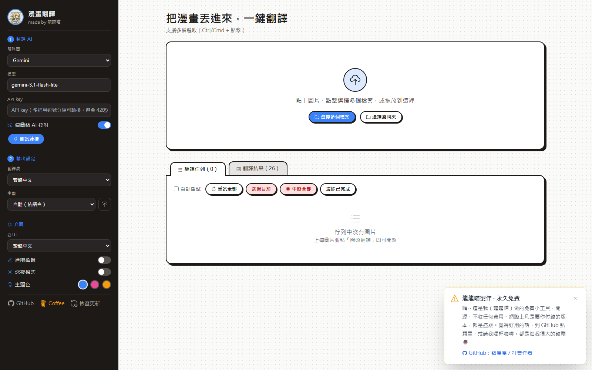
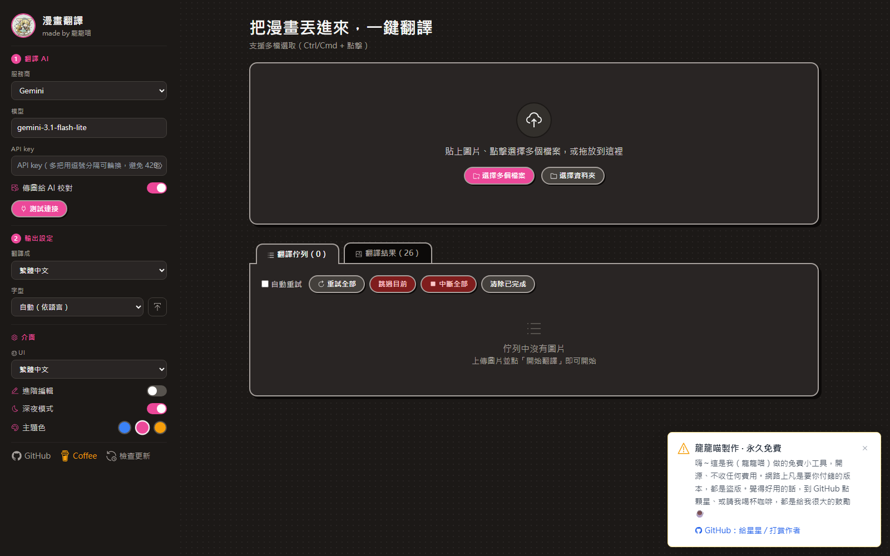
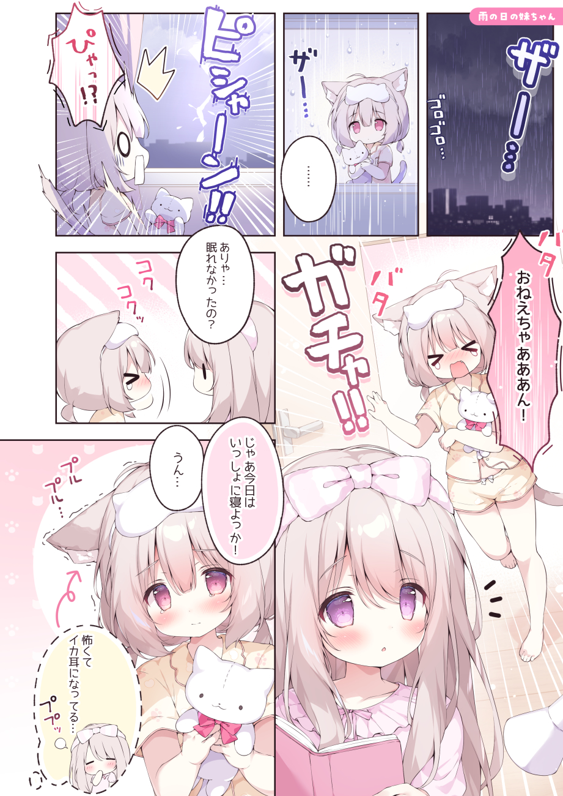
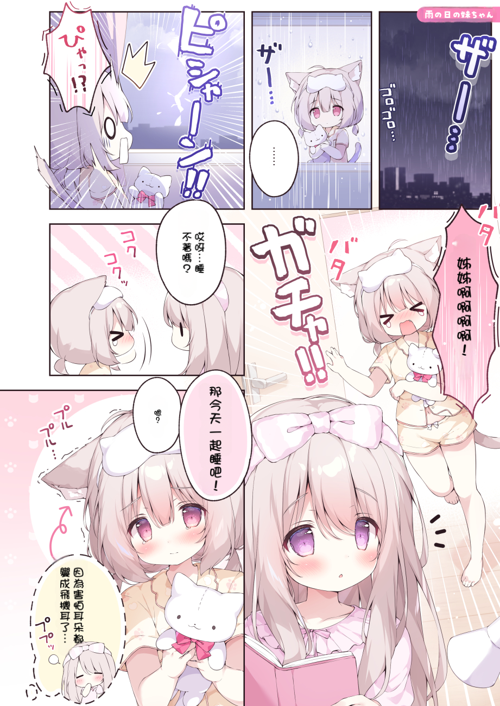
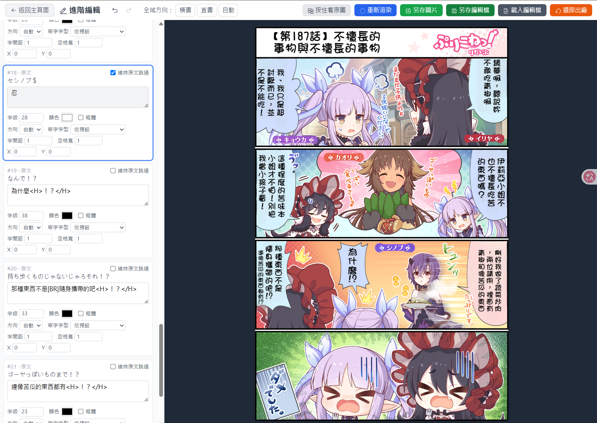

# Manga Translator · DragonMeow-MangaTranslator

[繁體中文](README.md) | [简体中文](README.zh-CN.md) | **English** | [日本語](README.ja.md)

A little tool that translates manga pages **in one click** — into Chinese, English, or other languages.
It detects the dialogue, erases the original text, and typesets the translation back into the bubbles. Comes with a web UI: just drag an image in.

> Hi, I'm **DragonMeow (龍龍喵)**. I polished this together with AI bit by bit — it brings together several great open-source projects (mainly [zyddnys/manga-image-translator](https://github.com/zyddnys/manga-image-translator), plus ideas for bubble detection and typesetting), wired up to AI translation.
> The dialogue translation quality is quite good; for the occasional layout or wording you want to refine, the built-in **Advanced Edit** lets you fine-tune it to your liking. I built it for my own convenience and decided to share it.
>
> This is a **completely free** open-source project. Any paid version is piracy.

---

## Get started in three steps (Windows)

1. **Install Python** — get 3.10 or 3.11 from [python.org](https://www.python.org/downloads/), and check **Add to PATH** during install.
2. **Double-click `setup.bat`** — sets up the environment automatically (takes a few minutes the first time).
3. **Double-click `start.bat`** — your browser opens the UI automatically. **Enter an API key** there, then drag a manga page in and it starts translating.

The release zip already bundles all models — nothing extra to download.

> **Gemini is the recommended API key** — [free to sign up](https://aistudio.google.com/apikey), has a free tier, easiest to get going.
> Paste it into the key field on the web page (comma-separate several keys for automatic rotation, which helps avoid rate limits on long manga).
> ChatGPT, Claude, DeepSeek and more are also supported — just pick the provider on the page and enter that provider's key.

---

## Interface

Settings live in the left sidebar (① pick an AI & paste your key → ② pick the output language); drop your manga on the right and it starts translating. Queue and results are tabs.
Comes with a **dark mode** and **blue / pink / amber** accent colors.

<table>
  <tr>
    <th>Light (blue)</th>
    <th>Dark mode (pink)</th>
  </tr>
  <tr>
    <td></td>
    <td></td>
  </tr>
</table>

---

## What it can do

- **Drag & drop**: one page, many pages, a whole folder, or a **zip / cbz of an entire volume**.
- **Many AI providers**: Gemini / ChatGPT / Claude / Grok / DeepSeek / Qwen / Kimi / GLM / Mistral / Groq / OpenRouter, or a custom endpoint.
- **Advanced Edit**: not happy with the result? Tweak each text box — translation, size, color, bold, letter spacing, font, position, horizontal/vertical — and re-render instantly.
- **Batch download**: select results and download them as a zip.
- **Online update**: check for and apply the latest version right from the web page (you see the changelog before deciding).
- **Multi-language UI**: Traditional/Simplified Chinese, English, Japanese; target language is freely selectable.

---

## Results (before / after)

Pictures speak louder. Left: original (Japanese). Right: translated (Chinese):

<table>
  <tr>
    <th>Original (Japanese)</th>
    <th>Translated (Chinese)</th>
  </tr>
  <tr>
    <td></td>
    <td></td>
  </tr>
</table>

> Dialogue translates smoothly almost every time; sound effects (SFX) are kept as-is by default. **If you're not happy with the output, use “Advanced Edit” below to adjust it.**

<sub>Sample artwork by [ツユハ🐈 (@tuyu_ha28)](https://x.com/tuyu_ha28/status/2058480714937663927), used here only to demonstrate translation results. All rights belong to the original artist.</sub>

---

## Not satisfied? Fix it with Advanced Edit

Open “Advanced Edit” after translating — text boxes on the left, live preview on the right:



- Per-box editing: **translation / size / color / bold / letter spacing / font / position / horizontal↔vertical**
- SFX, symbols and tiny text are skipped by default — to translate one, **uncheck “keep original”** and type your translation
- **Hold “Hold to see original”** to flip back to the source image for comparison
- Hit **Re-render** to see the result instantly; press **Save** when happy — the gallery will show the edited version
- You can also export an edit file to continue later, or **Reset to Original** to go back to the fresh machine translation

The 4-koma being edited above comes out like this:


---

## Requirements

- Windows or macOS, Python 3.10 or 3.11
- An **NVIDIA GPU or Apple Silicon (M-series) is recommended** (works without one, but detection/inpainting will be slow)
- An AI API key (Gemini has a free tier)

GPU acceleration (strongly recommended):
- **Windows**: after setup, just **double-click `setup_gpu.bat`** — it installs the CUDA build of PyTorch and verifies your GPU is detected
- **macOS**: download the `-mac.zip`, then run `bash setup.sh` → `bash start.sh` in Terminal; Apple Silicon enables MPS acceleration automatically — nothing extra to install

---

## Install from source (advanced)

```bash
git clone https://github.com/DragonMeow1012/DragonMeow-MangaTranslator.git
cd DragonMeow-MangaTranslator
setup.bat
# Only needed for git clone: download the manga-ocr model
app\.venv\Scripts\python -c "from huggingface_hub import snapshot_download; snapshot_download(repo_id='kha-white/manga-ocr-base')"
```
Other model weights download automatically on first run; the zip release bundles everything.

---

## Folder layout

The root keeps just two buttons; everything else lives in `app/`:

```
DragonMeow-MangaTranslator/
├── setup.bat        ← install (double-click once)
├── setup_gpu.bat    ← GPU acceleration (NVIDIA only, double-click once)
├── start.bat        ← launch (click this every time)
├── README.md
└── app/             ← code, models, fonts, settings
    ├── .env             (optional) API key can live here, but the web page is easier
    ├── server/          web UI + API
    ├── manga_translator/ translation core
    ├── models/          model weights
    └── fonts/           fonts
```

---

## Support the author

This tool is completely free. If it helps you:

- ⭐ Star it on [GitHub](https://github.com/DragonMeow1012/DragonMeow-MangaTranslator) (it really encourages me)
- ☕ [Buy me a coffee](https://buymeacoffee.com/dragonmeow1012)

---

## Credits & License

This tool builds on and thanks these excellent open-source projects:
[zyddnys/manga-image-translator](https://github.com/zyddnys/manga-image-translator), [manga-ocr](https://github.com/kha-white/manga-ocr), [LaMa](https://github.com/advimman/lama), [DBNet](https://github.com/MhLiao/DB), [bubble detector](https://huggingface.co/ogkalu/comic-speech-bubble-detector-yolov8m).
Fonts: [Taipei Sans TC](https://sites.google.com/view/jtfoundry/), [Noto Sans CJK](https://github.com/notofonts/noto-cjk) (both SIL OFL).

Licensed under **GPL-3.0**. Please respect your local copyright laws — personal/educational use only.
